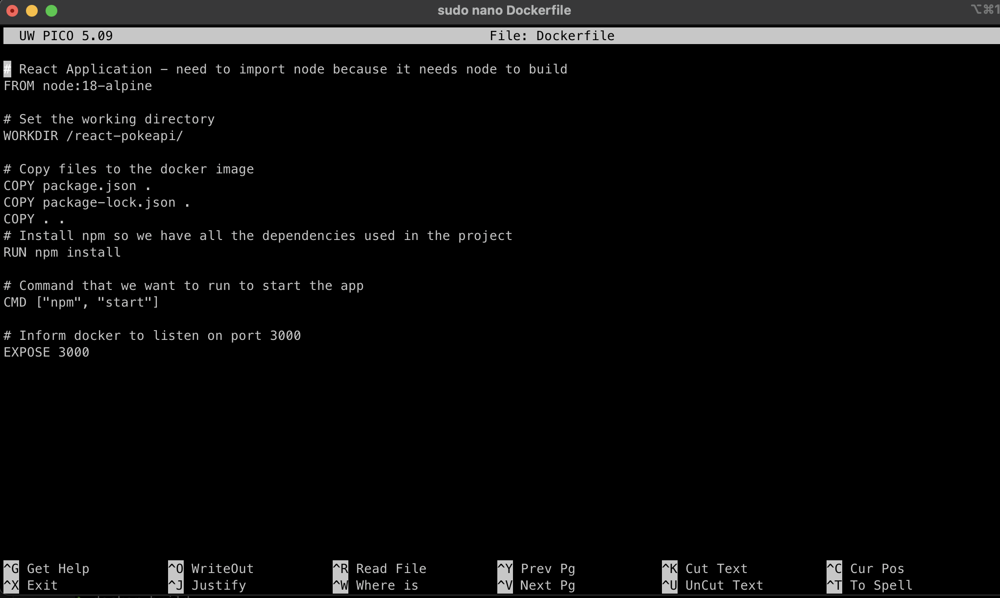
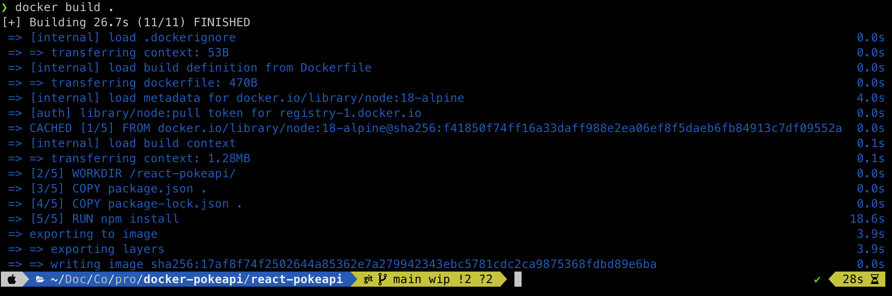
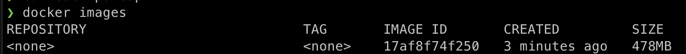
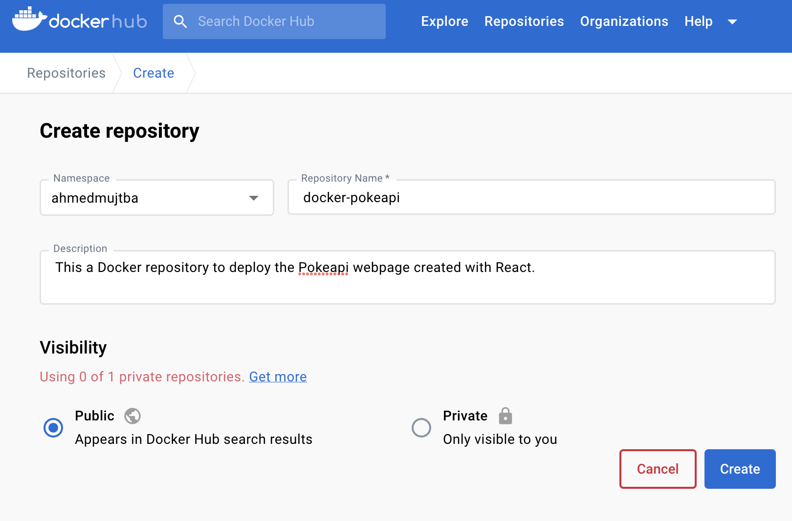
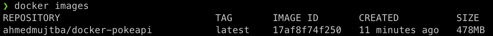
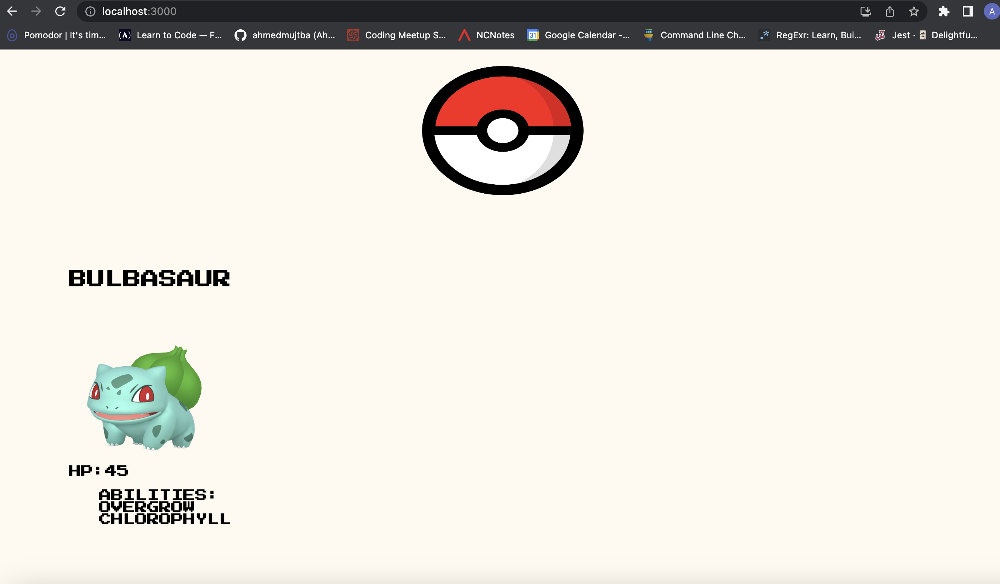
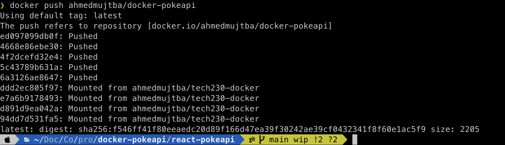

This is a step-by-step guide on how to deploy the pokemon webpage using Docker. The pokemon webpage has been created using pokeapi and react framework. It uses a pokeapi to fetch pokemon data and displays a list of pokemons on a page.

1. If you havn't already you'll need to install Docker on your OS (refer to Docker documneation for this). Otherwise, you can check which version is installed by running the following command:

```
docker --version
```

2. You would also need to create an account with docker in order to be able to deploy your app. Once completed

3. Create a github repo and clone it to your local machine. You can now go ahead and copy your app files to this directory.

4. Open `bash terminal` and navigate your way to the directory where you have copied the app folder and create a file called `Dockerfile` in the same directory that hosts your `package.json` file. You can do this by running the command below:

```
sudo nano Dockerfile
```

NOTE: Ensure you have the relevant permissions to execute this.

Within this `Dockerfile`, you can add all the commands to assemble a `docker image`.

5. In the `Dockerfile`, add the following lines of code

```
# React Application - need to import node because it needs node to build
FROM node:18-alpine

# Set the working directory
WORKDIR /react-pokeapi/

# Copy files to the docker image
COPY package.json .
COPY package-lock.json .

# Install npm so we have all the dependencies used in the project
RUN npm install

# Command that we want to run to start the app
CMD ["npm", "start"]

# Inform docker to listen on port 3000
EXPOSE 3000

```

It should look like this:



6. In the same directory where you have created the `Dockerfile`, now run:

```
docker build .
```

Output:


7. To check if a docker image has been created, run

```
docker images
```

Output:


As you can see at the moment it's not associated to a repo or hasn't been tagged. A docker tag is like a commit in git, it lets create a snapshot of our build at that specific stage.

8. before we can tag our docker image, we need to create a repo on docker where we can push this build to once we have tested that it works. create the repo as follows:



9. Now we can tag our docker image using the command below:

```
docker tag <container-id> ahmedmujtba/docker-pokeapi
```

NOTE: You can get the container id by simply running the `docker images` command again.

We can now see our docker image has been tagged and instead of name appearing as `none`, it now belongs to the repo we created.



10. Before we push this image to Docker repo, we need to know that our app actually works. In order to check this, run:

```
docker run -d -p 3000:3000 ahmedmujtba/docker-pokeapi
```

NOTE: Anyone can use the above command on their local machine and see the app work

11. Enter `localhost:3000` in the web browser and you should see output as below:



12. Now that we know our pokemon app runs perfectly and we have successfully deployed it with Docker, we can push this to dockerhub using the following command:

```
docker push ahmedmujtba/docker-pokeapi
```

We know this has been successfully pushed if we see an output with a green tag as shown below:


