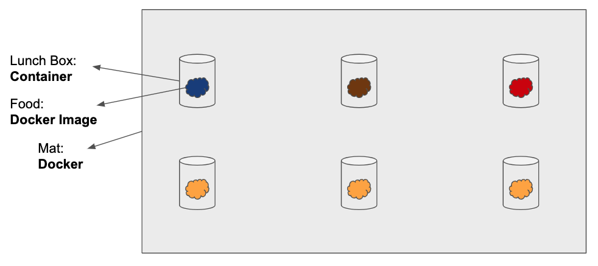

# Docker

## What is Docker

- Docker allows developers to put different pieces of softwares within containers
- It keeps these pieces separate from each other inside virtualised containers
- Docker automatically includes all the necessary dependecnies and libraries. No need to manually install them
- It will always run the same everywhere, on everyone's machine.

## Understanding Docker

- Docker container is like a lunchbox
- Keeps microservices separate the way a lunch box separates food i.e. avocado sandwich & cookie is not a good combination
- In the context of the app, you can maintain/update features without interrupting the whole service.

## Docker-Pokeapi

To learn how to deploy a React/NodeJS app with Docker, you can follow the guide [here](./Docker-Pokeapp-Guide.md)
